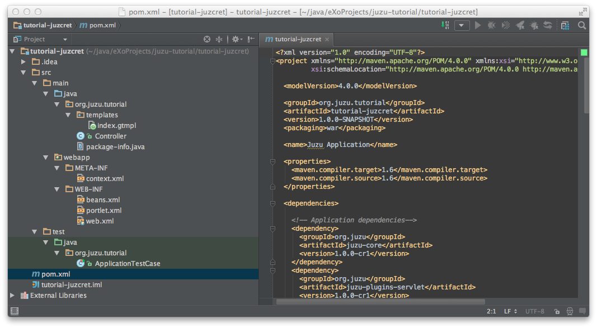
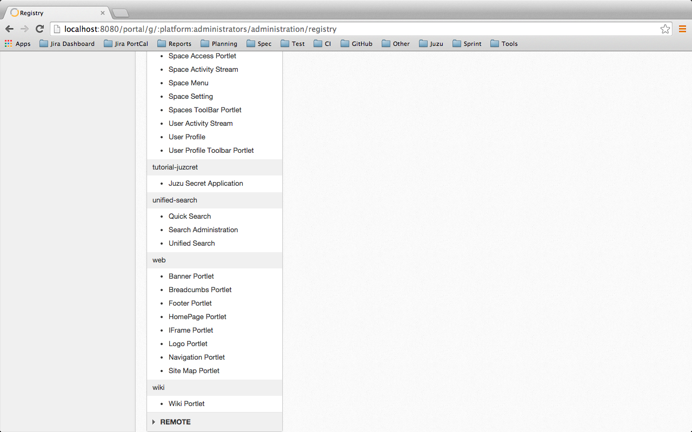
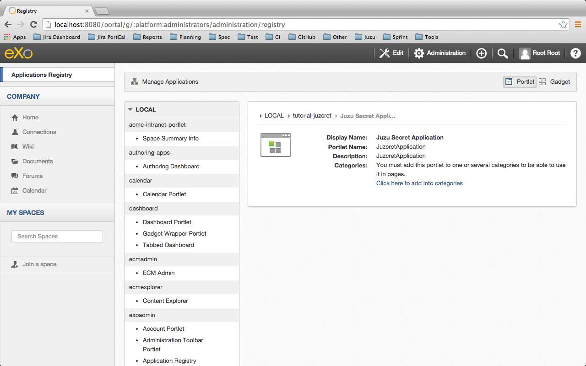
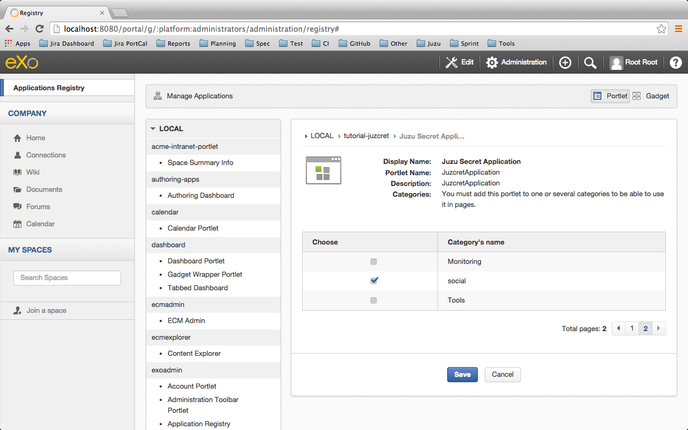
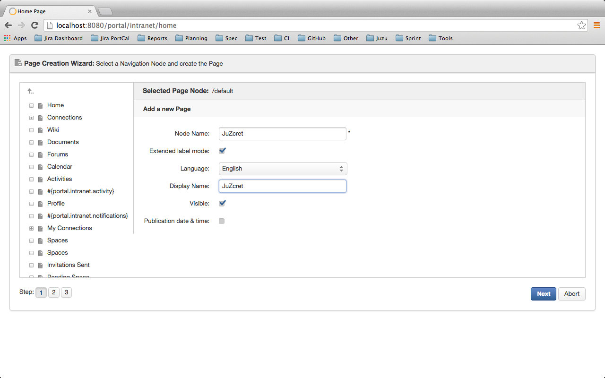
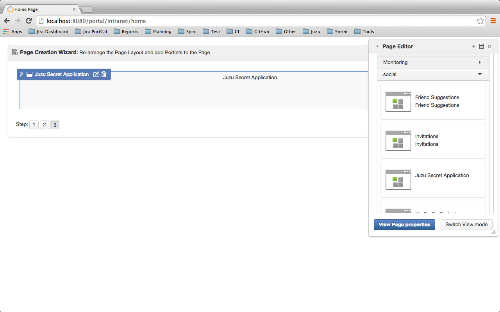
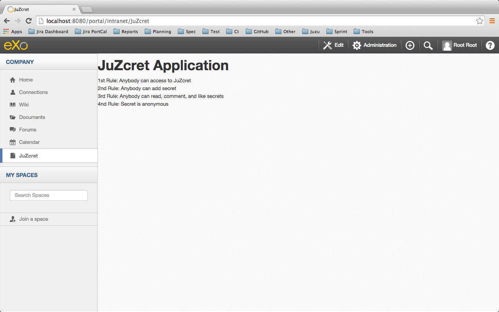

:docinfo1: docinfo1
:linkattrs:
:hardbreaks:

= Step 1 - Starting Up my project

= Introduction

In this tutorial we will learn *Juzu* by coding a real social Portlet named JuZcret. We will cover everything you need for *create real portlet application* and learn you the *best developement practice* for *Juzu*.
Guys, be patient ! We decide to split this tutorial into *7 steps* for a simple reason: we will introduce smoothly more and more advanced and interesting features to gradually build our application.
Yes, for sure we will start from an ugly Portlet with hard coded data... But, I promise ! At the end we will finish with a sexy fully integrated Portlet.
And you, as a true Juzu developer, you will have enough knowledge to develop *funny Juzu applications* and evangelize Juzu around you.

= The project

We will develop a new application named *JuZcret*. 
JuZcret is a funny social application allowing to share secrets.

*The rules of JuzCret:*

* 1st Rule: Anybody can access to JuZcret
* 2nd Rule: Anybody can add secret
* 3rd Rule: Anybody can read, comment, and like secrets
* 4th Rule: Secret is anonymous

= What we need

Juzu is a web framework written in *Java*, so first of all be sure you have a JDK install on your machine (later than 7).

We will manage dependencies and project compilation with *Maven*.

During coming steps, we will need to use the public maven repository of eXo for compilation. It's why you need to declare it in your maven settings.xml:
[source,xml]
----
    </profiles>
        <profile>
            <id>exo-public</id>
            <repositories>
                <repository>
                 <id>eXo-pub-repo</id>
                 <name>eXoPlatform public repo</name>
                 <url>http://repository.exoplatform.org/public</url>
                </repository>
            </repositories>
        </profile>

    ...

    </profiles>

    <activeProfiles>
        <activeProfile>exo-public</activeProfile>

        ...

    </activeProfiles>
----

NOTE: For more information about adding the eXo Platform Maven repository, link:http://docs.exoplatform.com/public/index.jsp?topic=%2FPLF41%2FPLFDevGuide.GettingStarted.Maven.html&cp=2_3_0_3_0[take a look here, , window="_blank"].

We will assume that you have a basic knowledge of *Java and Web development* (HTML, CSS, JavaScript).

I suggest you to use a Java IDE such as Eclipse or IntelliJ. But if you prefer, you can use a simple text editor like Sublime text, Emacs or even Vim (really..?).
The compilation and deployment will be manage in console with Maven.

Don't forget that we are developing a Portlet. So we need a Portal to deploy it. Let me think... we need a portal, we develop a sexy social application..? *eXo platform* will be the best !

= Create my Project

== Generate Juzu project using maven archetype

To start our project, we will use the maven Juzu Archetype which will automatically generate all the structure of your Juzu project by populating it with all files and directory necessary to run a simple *Juzu HelloWorld application*.

Open a new command line and place you on your working directory. Mine is:
[source,text]
----
$ cd ~/java/eXoProjects/juzu-tutorial/
----

Then tape

[source,text]
----
mvn archetype:generate \
    -DarchetypeGroupId=org.juzu \
    -DarchetypeArtifactId=juzu-archetype \
    -DarchetypeVersion=1.0.0-cr1 \
    -DjuzuServer=gatein \
    -DgroupId=org.juzu.tutorial \
    -DartifactId=tutorial-juzcret \
    -Dversion=1.0.0-SNAPSHOT \
    -DinteractiveMode=false
----

With the command above, you are creating a Juzu Portlet application project with the *Guice injection container*.
It’s possible to generate the application with different containers by specifying the option +-DjuzuInject+. The valid values are +guice+ (by default), +spring+ or cdi.

When generation is finished, a *build success message* is displayed in your command line:

[source,text]
----
[INFO] Using following parameters for creating project from Archetype: juzu-archetype:1.0.0-cr1
[INFO] ----------------------------------------------------------------------------
[INFO] Parameter: groupId, Value: org.juzu.tutorial
[INFO] Parameter: artifactId, Value: tutorial-juzcret
[INFO] Parameter: version, Value: 1.0.0-SNAPSHOT
[INFO] Parameter: package, Value: org.juzu.tutorial
[INFO] Parameter: packageInPathFormat, Value: org/juzu/tutorial
[INFO] Parameter: package, Value: org.juzu.tutorial
[INFO] Parameter: version, Value: 1.0.0-SNAPSHOT
[INFO] Parameter: juzuInject, Value: guice
[INFO] Parameter: artifactId, Value: tutorial-juzcret
[INFO] project created from Archetype in dir: /Users/TClement/java/eXoProjects/tutorial-juzcret/
[INFO] ------------------------------------------------------------------------
[INFO] BUILD SUCCESS
[INFO] ------------------------------------------------------------------------
[INFO] Total time: 44.882 s
[INFO] Finished at: 2014-08-29T14:13:46+07:00
[INFO] Final Memory: 13M/129M
[INFO] ------------------------------------------------------------------------
----

Now we have a new tutorial-juzcret folder containing a simple customized *Juzu HelloWorld application*.

Let's open it in our IDE

== Open your juzu project in IDE

Open your juzu project in your favorite IDE

== IntelliJ

See link:http://community.exoplatform.com/portal/g/:spaces:juzu/juzu/wiki/IntelliJ[How to configure IntelliJ to enjoy Juzu development, window="_blank"]

== Eclipse

See link:http://community.exoplatform.com/portal/g/:spaces:juzu/juzu/wiki/Eclipse[How to configure Eclipse to enjoy Juzu development, window="_blank"]

= Explore my project

Our project looks like a default Maven web project plus specific Juzu files and directory. The most important to understand is:

*pom.xml* contains all dependencies needed to run and test our juzu application.

*WEB-INF/* contains deployement descriptor for our application. If you have already develop java web application and portlet, nothing new for you here.

*templates/* contains all templates used in your application. A template is made of static and dynamic part allowing to form dynamic pages for our application.

*Controller.java* is our Juzu controller. it's where we will render *view* using template, define *resource* and more.

*package-info.java* is the configuration file of our application. It's where we will *declare the base package* of our application, *activate plugin*, add JavaScript or CSS resources and more.

It's quite simple, doesn't it..?  If you don't understand exactly the purpose of each file above, don't worry. Here was just an introduction, we will come back deeper on each file later. Don't stay here, go ahead !

= Run my application

Before running let us personalize a little bit our *HelloWorld Juzu application* to transform it in our *simple JuZcret application*.
First open the +portlet.xml+ file generated in _Juzcret/src/main/webapp/WEB-INF_ folder. If you are not familiar with portlet development, you just need to know that the portlet.xml is the standard JSR-286 portlet configuration file used by the portlet container to deploy your Portlet. Let's modify our portlet name, display name, and title:

[source,xml]
----
<?xml version="1.0" encoding="UTF-8"?>
<portlet-app xmlns="http://java.sun.com/xml/ns/portlet/portlet-app_2_0.xsd"
             version="2.0"
             xmlns:xsi="http://www.w3.org/2001/XMLSchema-instance"
             xsi:schemaLocation="http://java.sun.com/xml/ns/portlet/portlet-app_2_0.xsd
   http://java.sun.com/xml/ns/portlet/portlet-app_2_0.xsd">
   <portlet>
     <portlet-name>JuzcretApplication</portlet-name>
     <display-name xml:lang="EN">JuZcret Application</display-name>
     <portlet-class>juzu.bridge.portlet.JuzuPortlet</portlet-class>
     <init-param>
       <name>juzu.app_name</name>
       <value>org.juzu.tutorial</value>
     </init-param>
     <supports>
       <mime-type>text/html</mime-type>
     </supports>
     <portlet-info>
       <title>JuZcret Application</title>
     </portlet-info>
   </portlet>
</portlet-app>
----

Secondly make some changes for the presentation of the home page of JuZcret. Open +index.gtmpl+ in +templates+ folder and modify:

[source,html]
----
Hello World
----
By
[source,html]
----
<h1>JuZcret Application</h1>

    1st Rule: Anybody can access to JuZcret 
    2nd Rule: Anybody can add secret 
    3rd Rule: Anybody can read, comment, and like secrets 
    4nd Rule: Secret is anonymous 

----

== Deploy it in eXo Platform

Don't forget that we are developing a *Portlet application*. It means that we need a *Portal* to deploy it.

Let's start by downloading link:http://sourceforge.net/projects/exo/files/Platform4.1/eXo-Platform-community-4.1.0-RC1.zip/download[eXo Platform Community Edition, window="_blank"]

In command line, go to your download directory
[source,text]
----
$ cd ~/Downloads
----
Unzip the download file
[source,text]
----
$ unzip eXo-Platform-community-4.1.zip
----
Copy/Paste it in the directory of your of your choice (Mine is /java/eXoProjects/juzu-tutorial/platform-community-4.1/)
[source,text]
----
$ cp -R platform-community-4.1/ ~/java/eXoProjects/juzu-tutorial/platform-community-4.1/
----

Now we have to add our Portlet in PLF.

Go back to your working directory
[source,text]
----
$ cd ~/java/eXoProjects/juzu-tutorial/tutorial-juzcret/
----
Compile the application
[source,text]
----
$ mvn clean install
----

*BUILD FAILURE ???* What..??? I don't even finish the step one of this tutorial...!
Relax guys. As usual try to understand what's wrong...
In the maven log in the command line you can read
[source,text]
----
Results :

Failed tests:   testFoo(org.juzu.tutorial.ApplicationTestCase): expected:<[Hello World]> but was:<[JuZcret Application(..)

Tests run: 1, Failures: 1, Errors: 0, Skipped: 0
----

*A test failed ?*
Yes the Juzu archetype create a default unit test case with the HelloWorld to test that the html of our application equal "Hello World".
However it's not our case. We modified the index template, so the test failed.
You can take a look at this unit test in +test/java/org/juzu/tutorial/ApplicationTestCase.java+
[source,java]
---- 
@Test
  @RunAsClient
  public void testFoo() {
    driver.get(deploymentURL.toString());
    WebElement body = driver.findElement(By.tagName("body"));
    assertEquals("Hello World", body.getText());
  }
----

The aim of this step is not to learn you how to develop Unit test with Juzu. This will be cover later during step-7. For now, just remove +ApplicationTestCase.java+.

So compile again:
[source,text]
----
$ mvn clean install
----

Here you should get a *Build Success*. Great now it's time to deploy our Portlet in eXo Platform.

Copy the created *war* to eXo Platform webapps directory
[source,text]
----
$ cp ./target/tutorial-juzcret.war ~/java/eXoProjects/juzu-tutorial/platform-community-4.1.0-RC1/webapps/
----

Go to eXo Platform directory
[source,text]
----
$ cd ~/java/eXoProjects/juzu-tutorial/platform-community-4.1.0-RC1/
----

Start eXo in Dev mode
[source,text]
----
$ ./start_eXo.sh --dev
----

Open your web browser and go to link:http://localhost:8080/portal[http://localhost:8080/portal, window="_blank"]

NOTE: Username: root | Password: gtn

What we want to do it's to add our *new Portlet* on a dedicated *JuZcret Page*. Here everybody will have the availability to see and share secrets !
For doing this we need to proceed in two steps:

1. Add our new Portlet in a category
1. Add our new Portlet in the dedicated JuZcret Page

To be able to add our new Portlet, firstly we need to add it in a category.
Because we are developing a social application, we will add it in the *Social Category*.

Click on Administration->Applications and click on Portlet on the top right.
If you scroll down you should see our Portlet *Juzu Secret Application* in the *tutorial-juzcret* section

Click on it

Click on "Click here to add into categories"
Add it in Social Category

Then Save

Secondly we want to add our new Portlet on the dedicated *JuZcret Page*.

Go back the *Home Page* of eXo and then click on Edit on the top navigation bar. Then click on Page -> Add Page to open the Page Creation Wizard form.
Select the up level on the left menu, set JuZcret as Node and Display Name and check visible:

Click on Next button two times

In _Page Editor_ on the top right, expand social and *Drag & Drop* _Juzu Secret Application_ on the left:

Then Click on the finish icon on the top right of Page Editor and look at the result

ah.. ok.. nice..
Ah ah we get what I promised : *a ugly static Portlet !*

It's time to go to link:./step2.html[Step 2 - Viewing and posting Secret] and add some functionality to our Portlet...

++++

++++
