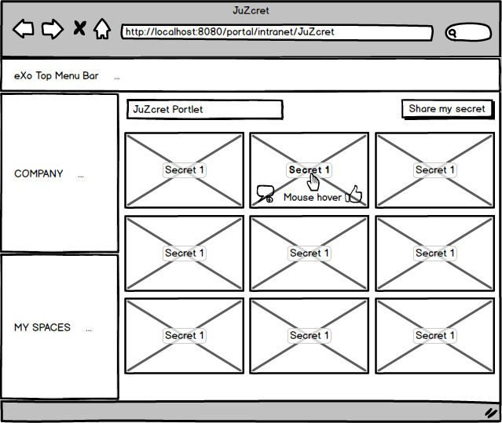
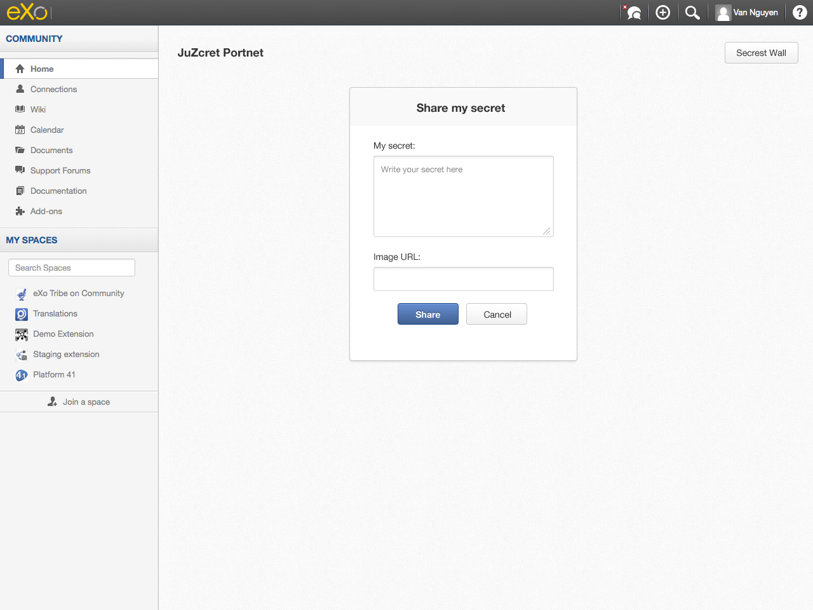
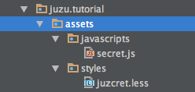
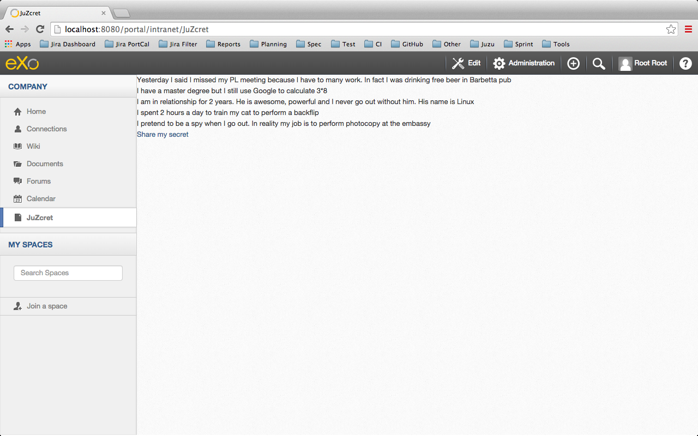
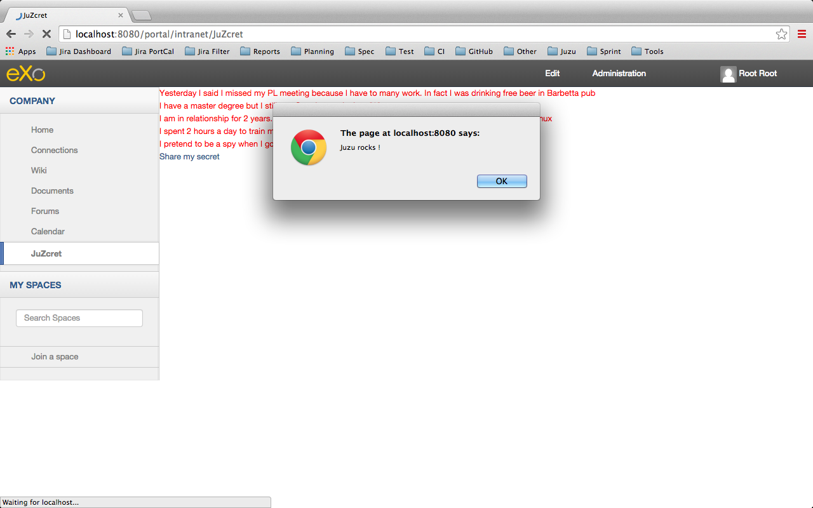
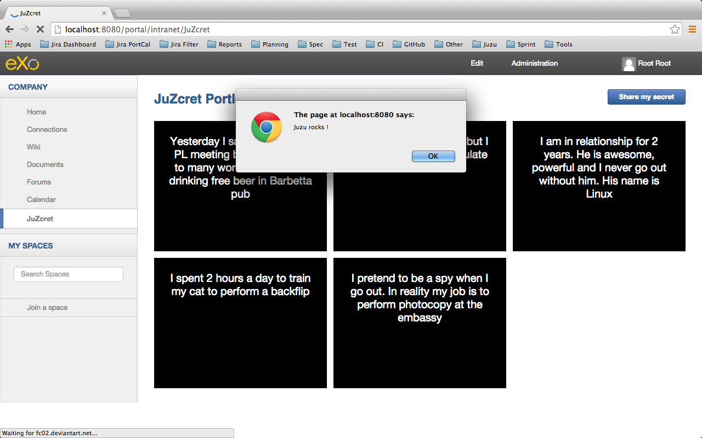
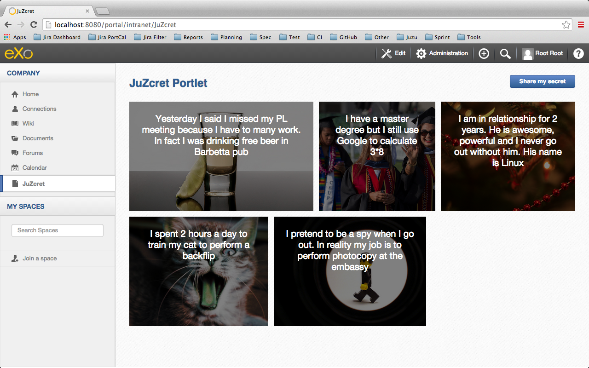
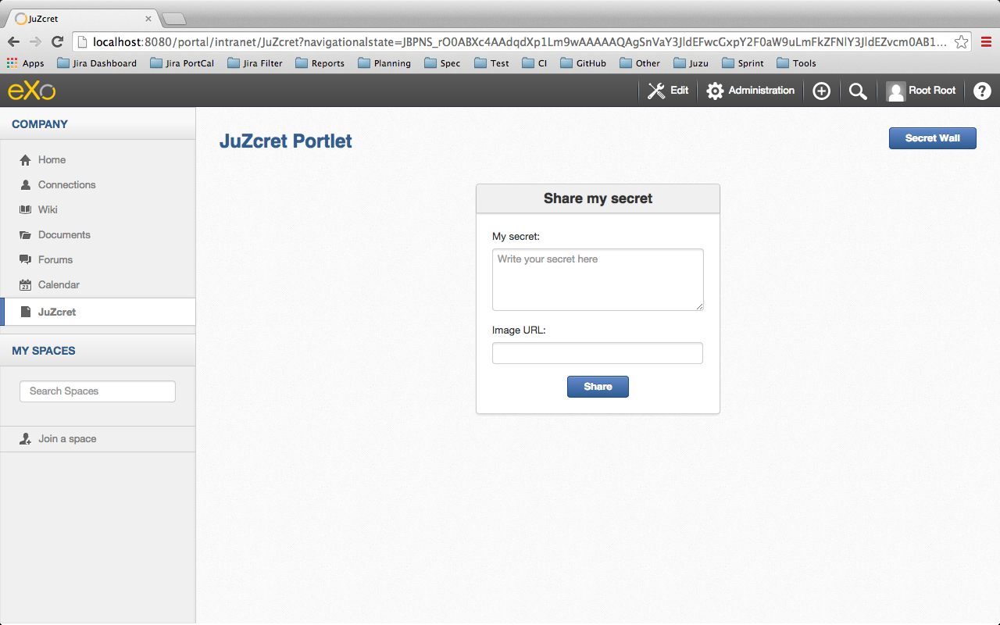
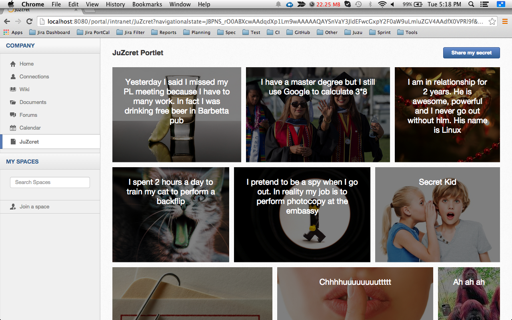

:docinfo1: docinfo1

= Step 3 - Building a sexy Secret Wall

From the step 2 we learn how to add some functionality to our application. We can now see a list of secrets and share new one. It's working but it's ugly... so during *step 3* we will focus on the *UI of JuZcret*..

= Introduction
It's time to think a little bit about the *design* of *JuZcret application*.
We have to display a list of secrets that can be enliven by an image. For doing this we will create a *beautiful Secret Wall page*.
Don't forget also that we have the availability to add new secret. We need a new add secret page with a *nice form to share secret easily*.
During this step you will learn how to incorporate easily *Javascript* and *Less* file in a *Juzu application*.

== Why Less and not only CSS
Because Less it's an *amazing stylesheet dynamic language* that we love to use in eXo and the *integration with Juzu* is so *easy* that you don't have any more excuse to not use it.
Just declare it and *Juzu* will take care to *transform it in CSS* during compilation.
For newbie, you just need to know that Less *extends CSS language* with many interesting features like variables, mixins, operations and functions. If you want more information I let you check on the link:http://lesscss.org/[Less website].

= Create a Mockup
This tutorial is also a place to give some good practice to *develop nice application*. So before taking the code by storm we will create a *UI mockup* (and then nicely ask BD and UI team some help that always accept to give us with a smile ;)).

After hour and hour of thinking is what I created as *mockup for the secret wall* with balsamiq:

I take it with me to ask some help from *UI team* and after some *tricky things* on Photoshop this is what they give me:

Ok, I yield..!
And for free, the add secret page:

= Adding Less

Before using less we need to add a *dependency to juzu-plugins-less4j* in the pom.

[source,xml]
----
    <dependency>
        <groupId>org.juzu</groupId>
        <artifactId>juzu-plugins-less4j</artifactId>
        <version>1.0.0-cr1</version>
    </dependency>
----

The *Juzu Plugin Less4j* will take care of *compiling* automatically the *Less file to CSS* file during the maven compilation. The only thing that we have to do it's to create a new file +juzcret.less+ in the +org.juzu.tutorial.assets.styles+ package and then declare it in the +package-info.java+:

[source,java]
----
@Less(@Stylesheet("styles/juzcret.less"))
@Assets("*")
----

If you want to *be more productive* and have stylesheets easily *maintainable* and *extendable*, I advise you to use *Less*. if you don't want, yes you can use directly CSS file in Juzu application. Add your CSS file in +org.juzu.tutorial.assets.styles+ package and declare it in +package-info.java+ as below:
[source,java]
----
@Stylesheets({@Stylesheet(value = "styles/my.css")})
----

You have to notice the +@Assets+ annotation. This annotation allow to *declare assets* (Stylesheet, Script) that will be loaded when the portlet is displayed. By setting ("*") we declare all the assets.

= Adding jQuery

We will use *Javascript* to randomly set the width of the secret boxes on the Secret Wall. To simplify this task, we decide to use the *jQuery library*.

First create a new file +secret.js+ in the +org.juzu.tutorial.assets.javascripts+ package:

The *jQuery library* will be simply retrieved from *WebJars* thanks to the *Juzu WebJars plugin*. The Juzu WebJars plugin allow you to easily use *awesome javascript library* (link:http://www.webjars.org/[take a look here]) in your Juzu project. You just need to declare the WebJars in your +pom.xml+ and in the +package-info.java+. It saves us from downloading and cloning the library file and facilitate the management of your *JavaScript dependencies*.
In our case we want to use jQuery. We just have to add the juzu-plugins-webjars  and the jQuery webjar dependency in the +pom.xml+:

[source,xml]
----
<dependency>
      <groupId>org.juzu</groupId>
      <artifactId>juzu-plugins-webjars</artifactId>
      <version>1.0.0-cr1</version>
</dependency>
<dependency>
      <groupId>org.webjars</groupId>
      <artifactId>jquery</artifactId>
      <version>1.10.2</version>
</dependency>
----

Before to use it in our application we need to *declare* in +package-info.java+ the *jQuery Webjar* and the 2 assets: +jquery.js+ and our app js: +secret.js+ using *@Script* annotation.

[source,java]
----
@WebJars(@WebJar("jquery"))
@Scripts(
   {
       @Script(id = "jquery", value = "jquery/1.10.2/jquery.js"),
       @Script(value = "javascripts/secret.js", depends = "jquery")
     }
 )
 @Assets("*")
----

Notice that we declare that +secret.js+ depends on jquery. This ensure that *jquery is available* to +secret.js+ at *runtime*.

= Test Less and JQuery

We created and declared all necessary files to implement the step-3.
Configure your [[Juzu project with JRebel>>Develop Juzu Portlet with JRebel]] and compile it:
[source,text]
----
$ mvn clean install
----
Replace the war in the +webapp+ directory of PLF by the new one just created and *start the server*:
[source,text]
----
$ ./start_eXo.sh --dev
----

Go to link:http://localhost:8080/portal/intranet/JuZcret[] and you see exactly the same thing that at the end of step 2:

Let's perform a quick test to see if *JRebel* hot deployment is working and integration of *Less* and *jQuery* also.

Modify +secret.js+ with:

[source,javascript]
----

(function ($) {

    $(document).ready(function () {
        window.alert("Juzu rocks !");
    });

})($);
----

Modify +juzcret.less+ with:

[source,css]
----
// Variables
//====================
@textColor: red;

// Common Style
//====================
.secret-wall-list {
  color: @textColor;
}
----

Compile:
[source,text]
----
$ mvn clean install
----
When you get a Build Successful message, refresh link:http://localhost:8080/portal/intranet/JuZcret[]:

jQuery *display a pop-up* when the DOM is ready and the CSS resulting from our Less file *change the text color* of secret to red.
Now we are ready to implement a *nice UI* for our *JuZcret* application.

= The Secret Wall

Open +secretWall.gtmpl+ template and replace by the new code below:

[source,html]
----
#{param name=secretsList/}

    

        

            

                <h3 class="title">JuZcret Portlet</h3>
            

            

                <a class="btn btn-primary" href="@{JuZcretApplication.addSecretForm()}"
                   role="button">Share my secret</a>
            

        

    

    <ul class="secret-wall-list clearfix">
        <% secretsList.each { secret -> %>
        <li>
            

                
${secret.message}

            

        </li>
        <% } %>
    </ul>

----

Open the +juzcret.less file+ and modify it as below:

[source,css]
----
// Variables
//====================
@heightSecretItem: 238px;
@secretItemGutter: 6px;

// Mixins
//====================

// Opacity
.opacity(@opacity) {
  opacity: @opacity;
  // IE8 filter
  @opacity-ie: (@opacity * 100);
  filter: ~"alpha(opacity=@{opacity-ie})";
}

// Common Style
//====================

// Secret Wall
.secret-wall-container {
  padding: 20px 30px;
  .btn-primary {
    padding-right: 20px;
    padding-left: 20px;
  }
}
.secret-wall-container, .secret-wall-container * {
  -webkit-box-sizing: border-box;
  -moz-box-sizing: border-box;
  box-sizing: border-box;
}
.secret-wall-heading {
  margin-bottom: 10px;
  .btn {
    margin-top: 6px;
  }
}
.secret-wall-list {
  margin: 0 -@secretItemGutter;
  > li {
    float: left;
    padding: @secretItemGutter;
    width: 100% / 3;
    .secret-image {
      background-repeat: no-repeat;
      background-size: cover;
      background-color: #000;
      position: relative;
      height: @heightSecretItem;
      width: 100%;
      display: block;
      &:before {
        background: none repeat scroll 0 0 rgba(0, 0, 0, 0.5);
        content: "";
        display: block;
        height: 100%;
        position: absolute;
        width: 100%;
      }
    }
    .secret-mesage {
      bottom: 65px;
      color: #fff;
      font-size: 20px;
      font-weight: normal;
      left: 25px;
      line-height: 24px;
      position: absolute;
      right: 25px;
      text-align: center;
      top: 25px;
    }
    &:nth-child(3n+3) {
      .popover{
        right: -1px;
        .arrow {
          left: auto;
          right: 34px;
        }
      }
    }
  }
}
----

Compile:
[source,text]
----
$ mvn clean install
----
When you get a Build Successful message, refresh link:http://localhost:8080/portal/intranet/JuZcret[] and take a look to your new *Secret wall*:

Notice that the title *JuZcret Portlet* in a +<h3>+ tag is displayed in blue on the top left of our application. We didn't override the default +<h3>+ tag in +juzcret.less+ but it's displayed in blue because default +<h3>+ tag is *override in exo-platform.css* as link:http://exoplatform.github.io/ux-guidelines/Typography/Typography.html#S1[you can see here]. When you develop a *Juzu portlet for PLF*, you can *reuse all class* declared in http://exoplatform.github.io/ux-guidelines without need to declare it before. These class are available by default for *all Portlets in PLF*.

You have seen that we still have the *Juzu rocks* popup…! Let’s modify the *Javascript* to remove this popup and set a width of *secret boxes randomly*.
Open the +secret.js+ and modify it as below:
[source,javascript]
----

(function ($) {

    $(document).ready(function () {

        function getRangeRandom(min, max) {
            return Math.ceil(Math.random() * (max - min) + min);
        }

        function randSecretBoxWidth() {
            var randBoxNum = getRangeRandom(23, 43);
            //Test if we are on th third image of the line
            if (counterImg >= 2) {
                //The third image of the line fill all the remaining place
                randBoxNum = 100 - totalWidthLine;
                //counter place taken by previous image in the line set to 0
                counterImg = 0;
                totalWidthLine = 0;
            }
            else {
                //Increase counter and the place taken by previous image in the line
                counterImg++;
                totalWidthLine += randBoxNum;
            }
            //Return the width of the secret box
            return randBoxNum;
        }

        //Var to know the number of image in the line
        var counterImg = 0;
        //Var to know the place taken by previous image in the line
        var totalWidthLine = 0;

        //Get all secrets boxes
        var nums = document.getElementsByClassName("secret-wall-list");
        var listItem = nums[0].getElementsByTagName("li");

        //Set a random width
        for (var i = 0; i < listItem.length; i++) {
            listItem[i].style.width = randSecretBoxWidth() + "%";
        }

    });

})($);
----

Compile:
[source,text]
----
$ mvn clean install
----
When you get a Build Successful message, refresh link:http://localhost:8080/portal/intranet/JuZcret and take a look to your new JuZcret wall:

= Add Secret

We have to *modify* also the ugly *add secret form*. Open +addSecret.gtmpl+ template and replace by the new code below:

[source,html]
----

    

        

            

                <h3 class="title">JuZcret Portlet</h3>
            

            

                <a class="btn btn-primary" href="@{JuZcretApplication.index()}" role="button">Secret Wall</a>
            

        

    

    

        

            <h4 class="title">Share my secret</h4>
            

                <form class="share-secret-form" action="@{JuZcretApplication.addSecret()}" method="POST" role="form">
                    

                        <label class="control-label" for="mySecret">My secret:</label>
                        

                            <textarea id="mySecret" rows="3" name="msg" placeholder="Write your secret here"></textarea>
                        

                    

                    

                        <label class="control-label" for="secrImgUrl">Image URL:</label>
                        

                            <input type="text" id="secrImgUrl" name="imgURL" placeholder="">
                        

                    

                    

                        

                            <button type="submit" class="btn btn-primary">Share</button>
                        

                    

                </form>
            

        

    

----

Above you can notice that we reuse default PLF UI component like *uiBox* and *uiContentBox*.

Open the +juzcret.less+ file and add at the end:

[source,css]
----
// Add Secret

.share-secret-form {
  .form-title {
    margin: 0 0 10px;
    text-shadow: none;
  }
  textarea {
    min-width: 271px;
    max-width: 271px;
    max-height: 300px;
    margin-bottom: 10px;
    min-height: 80px;
  }
  textarea, input {
    margin-bottom: 5px;
  }
}

.share-secret-box {
  display: inline-block;
  text-align: left;
  margin-top: 20px;
  .title {
    text-align: center;
  }
  .btn {
    min-width: 78px;
  }
}
----

Compile:
[source,text]
----
$ mvn clean install
----
When you get a Build Successful message, refresh link:http://localhost:8080/portal/intranet/JuZcret[], click on the *Share my secret* button on the top right and take a look to your *new Add Secret form*:

That's it! Play with the application and *enjoy to add your personal secrets*:

Here we are ! As promised a *sexy JuZcret Portlet* ! And it’s not finish… let's continue to link:./step4.html[step 4 to add new functionality]

_The final source of step 3 is available for link:https://github.com/juzu/portlet-tutorial/tree/step-3[downloading on Github]_

_Thanks a lot to BD and UI team for their contribution ;)_