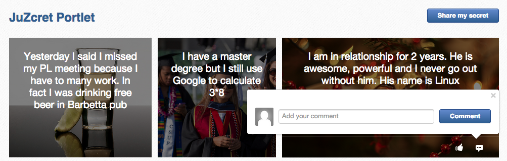

= Like and comment Secret

What would be a *social feature* without any user interaction ? Nothing...
It's why during this step, we'll add two very original social feature to our *JuZcret* application: A user can comment and "like" a secret... Crazy ! :D
By implementing these new features we will learn amongst other how to use *Ajax* with Juzu, *interact with Portlet Container* or add an *EDIT mode* to our Portlet.

Let's start by improving a little bit the application models.

= Models

Here no Juzu Stuff, we will just *improve our current model*. Lets add the top of the tree, *Model*. This class contains common attributes for *Secret* and *Comment*:

[[image:ClassDiagram-step4.png]]
image::images/step4/ClassDiagram-step4.png[Class Diagram,600,align="center"]

In +org.juzu.tutorial.models+ package create +Model+ class as below:

[source,java]
----
public class Comment extends Model {
  private String userId;
  private String content;

  //getters and setters...
}
----

Then +Comment+ class:

[source,java]
----
public class Model implements Serializable {
  private String id;
  private Date createdDate;

  //getters and setters...
}
----

We also need to improve +Secret+:
1. Make Secret *extends Model class* to inherits the parent attributes.
1. A Secret object will contains *several Comment relationship*, and *several like* (that consist of a simple list of userId):

[source,java]
----
public class Secret extends Model {
  private Set<String> likes;
  private List<Comment> comments;
  ...
}
----

That's enough ! Our model is *ready for comment and like feature*. Now we need to improve the Secret service by providing an API to add comments and like secrets.

= Improve Secret Service

Our Secret Service need *two more methods* to manage the new functionalities. One for *adding comment to secret* (addComment method) and an other one to *like a secret* (addLike method).

_Similarly to step-2, data is still saved in memory for now._

Firstly, declare these two method in the +SecretServie+ interface:

[source,java]
----
public Comment addComment(String secretId, Comment comment);

public Set<String> addLike(String secretId, String userId);
----

Then implement these 2 methods in the +SecretServiceMemImpl+:

[source,java]
----
public Comment addComment(String secretId, Comment comment) {
    Secret secret = getSecret(secretId);
    if (secret != null) {
      comment.setId(UUID.randomUUID().toString());
      comment.setCreatedDate(new Date());

      List<Comment> comments = secret.getComments();
      comments.add(comment);
      secret.setComments(comments);
    }
    return comment;
  }

  public Set<String> addLike(String secretId, String userId) {
    Secret secret = getSecret(secretId);
    if (secret != null) {
      Set<String> likes = secret.getLikes();
      +You can like only one time
      if (!likes.contains(userId)) {
        likes.add(userId);
      }
      secret.setLikes(likes);
      return likes;
    }
    return null;
  }
----

Done for *service layer* !

We are agree that this two methods are pretty simple and self-explained and I don't have to spend time on it.

NOTE: If you are some doubt, I remember you that each step is available on a dedicated branch. For link:https://github.com/juzu/portlet-tutorial/tree/step-4[downloading on Github the result of step-4 here it is]

It's time to go back to Juzu and improve the *presentation layer*.

= Present like and comment

The comment and like action will be manage using Ajax via the *@Ajax* Juzu annotation from the Juzu Ajax plugin. The Ajax plugin like the Binding plugin is already included in Juzu-core, so no need to add new dependencies in our pom.

Notice that we declare that +secret.js+ depends on jquery. This ensure that *jquery is available* to +secret.js+ at *runtime*.

It's important to know that the *Juzu-Ajax plugin* depends on *jQuery*. So it's mandatory to declare jquery if we want to use this plugin. For us we already declare it in the previous step so no need.

It's now ready to *use @Ajax in our controller*. Lets add 2 new controller methods in +JuZcretApplication+:
[source,java]
----
  @Ajax
  @Resource
  public Response addComment(String secretId, @Mapped Comment comment, SecurityContext context) {
    Principal user = context.getUserPrincipal();
    comment.setUserId(user.getName());
    Comment result = secretService.addComment(secretId, comment);
    if (result != null) {
      return Response.ok(new JSONObject(result).toString()).withMimeType("text/json");
    } else {
      return Response.status(503);
    }
  }

  @Ajax
  @Resource
  public Response addLike(String secretId, SecurityContext context) {
    Principal user = context.getUserPrincipal();
    List<String> likes = secretService.addLike(secretId, user.getName());
    if (likes != null) {
      return Response.ok(new JSONArray(likes).toString()).withMimeType("text/json");
    } else {
      return Response.status(503);
    }
  }
----

*@Ajax annotation* comes from *Juzu-Ajax plugin*, it provide us convenient *ajax calling method: jzLoad, jzAjax*. We'll use this later in secret.js.

*@Resource* is a new type of Controller. Resource controllers are pretty much like a view controllers except that they must produce the entire response sent to the client and that is perfect for implementing ajax request.

*@Mapped* allow to map request parameter to Bean types. Juzu do automatically the conversion between the primary types and the request parameters but for a Bean, we need to declare it with @Mapped. Consequently the parameters of a form will be automatically mapped to the attribute of the @Mapped Bean.

Juzu also *injects automatically* some *contextual useful objects* that you can use:
* SecurityContext (provide security info, like current logged in user)
* HttpContext
* RequestContext
* ApplicationContext
* UserContext
* ClientContext.
You just need to declare it in the *method sign* as we do above for *SecurityContext* and Juzu will *inject them automatically* at runtime.

You notice that we response a Json data to our client by declaring the *MimeType* to text/json. Now we need to handled this response on the client side.

= Template

We need to add two new buttons to *like a secret* and *comment a secret* in the +secretWall.gtmpl+:

[source,html]
----
[...]
//Add it just after 
${secret.message}

                    <a class="btn-like secr-toggle-link toggle-like-comment" href="#"><i
                            class="uiIconThumbUp uiIconWhite"></i></a>
                    <a class="btn-popup-comment secr-toggle-link toggle-write-comment" href="#"><i
                            class="uiIconComment uiIconWhite"></i></a>
                

----

For *Comment feature* we need also to display a popover to how the list of current comments and add a new comment:

[source,html]
----

[...]

//Add it just after the declaration of the two new buttons
        

                    <button class="closePopover close" type="button">&times;</button>
                    

                    

                        

                            <ul class="secr-comments-list">
                                <% secret.getComments().each { comment -> %>
                                <li><!--Add class .open-popover to display popover -->
                                    

                                        <a class="pull-left" href="http://localhost:8080/portal/intranet/profile/${comment.userId}">
                                            
                                        </a>

                                        

                                            

                                                <a class="cm-user-name" href="http://localhost:8080/portal/intranet/profile/${comment.userId}">${comment.userId}</a> ${comment.createdDate}
                                            

                                            
${comment.content}

                                        

                                    

                                </li>
                                <% } %>
                            </ul>
                        

                        

                            <button class="btn-comment btn btn-primary pull-right">Comment</button>

                            

                                

                                    

                                        

                                        

                                            <textarea name="comment" class="secret-add-comment" placeholder="Add your comment"></textarea>
                                        

                                    

                                

                            

                        

                    

                

----

After that we need to improve our +juzcret.less+ file to manage new added class. Update the existing less file with these:

[source,css]
----
//Variables
//====================

[...]

@secretActionHeight: 43px;

//Mixins
//====================

[...]

//Border Radius CSS3
.border-radius(@border-radius) {
  -webkit-border-radius: @border-radius;
  -moz-border-radius: @border-radius;
  -ms-border-radius: @border-radius; //IE9 only
  border-radius: @border-radius;
}
//Transform CSS3
.transform(@transform) {
  -webkit-transform: @transform;
  -moz-transform: @transform;
  -ms-transform: @transform; //IE9 only
  transform: @transform;
}
//Transitions CSS3
.transition(@transition) {
  -webkit-transition: @transition;
  -o-transition: @transition;
  transition: @transition;
}
//Translate CSS
.translate(@x; @y) {
  -webkit-transform: translate(@x, @y);
  -ms-transform: translate(@x, @y); //IE9 only
  -o-transform: translate(@x, @y);
  transform: translate(@x, @y);
}

//Common Style
//====================
.secret-wall-container {
  padding: 20px 30px;
  .btn-primary {
    padding-right: 20px;
    padding-left: 20px;
  }
}
.secret-wall-container, .secret-wall-container * {
  -webkit-box-sizing: border-box;
  -moz-box-sizing: border-box;
  box-sizing: border-box;
}
.secret-wall-heading {
  margin-bottom: 10px;
  .btn {
    margin-top: 6px;
  }
}
.secret-wall-list {

  [...]

    .secret-action {
      border-top: 1px solid rgba(255, 255, 255, 0.5);
      bottom: 0;
      height: 0;
      left: 0;
      line-height: @secretActionHeight;
      padding: 0 25px;
      position: absolute;
      right: 0;
      text-align: right;
      overflow: hidden;
      .transition(all 200ms ease-out 0s);

      .secr-toggle-link {
        + .secr-toggle-link {
          margin-left: 15px;
        }
        > i {
          margin-right: 5px;
        }
        .numb {
          color: #fff;
          font-size: 13px;
        }
        .uiIconComment {
          margin-top: 2px;
        }
      }
    }
    .popover {
      max-width: 500px;
      top: auto;
      bottom: 46px;
      left: auto;
      right: -205px;
      width: 500px;
      margin: 0px;
    }
    .close {
      line-height: 16px;
      padding: 1px 5px;
      position: absolute;
      right: 0;
      top: 0;
    }
    .media {
      > .pull-left {
        > img {
          width: 36px;
          height: 36px;
          .border-radius(2px);
        }
      }
    }
    &:hover, &.open-popover {
      .secret-action {
        height: @secretActionHeight;
      }
    }
    &.open-popover {
      .popover-secret {
        .opacity(1);
        display: block;
      }
    }
    &:nth-child(3n+3) {
      .popover{
        right: -1px;
        .arrow {
          left: auto;
          right: 34px;
        }
      }
    }
  }
}
.secret-popup {
  width: 500;
  height: 280px;
  background: #fff;
  border: 1px solid rgba(0, 0, 0, 0.5);
  display: none;
  &.in {
    display: block;
  }
}
.popover-secret {
  .popover-content {
    padding: 15px;
  }
}
.secr-comments-box {
  .secr-viewall {
    font-size: 13px;
    margin-bottom: 15px;
  }
}
.secr-comments-list {
  margin-bottom: 20px;
  max-height: 150px;
  overflow: auto;
  > li {
    line-height: 18px;
    + li {
      margin-top: 20px;
    }
    .media {
      > .pull-left {
        display: block;
      }
    }
    .cm-user-name {
      font-weight: bold;
    }
    .cm-time {
      color: #999999;
      font-size: 12px;
      margin-left: 5px;
    }
  }
}
.secr-create-comment {
  .btn-primary {
    float: right;
    margin-left: 10px;
    margin-top: 3px;
  }
  .secr-write-comment {
    .fluid-colum {
      float: left;
      width: 100%;
      > .inner {
        margin-left: 46px;
      }
    }
    .media {
      > .media-body {
        margin-left: 46px;
        padding-top: 3px;
      }
    }
    textarea {
      height: 29px;
      resize: none;
      width: 100%;
      &:focus {
        box-shadow:none;
      }
    }
  }
}

[...]
----

NOTE: [...] means sections already added in step 3. If you feel a little bit lost, take a look directly on the github project for the juzcret.less file

Now we have 2 buttons for *comment and like features* and a popover to display the list of comments:

The second step is to add some *js handlers* to manage this two features using Ajax.

== Javascript Handler

As for Stylesheet declaration, when we declare a Style in +package-info.java+, Juzu is expecting to find it in the *assets package*. For reminder, we declared previously our app js as below:
[source,java]
----
@Script(value = "javascripts/secret.js", depends = "jquery")
----

Add the first *snippet* in charge of the like feature:

[source,javascript]
----
    //Ajax for managing like function
    $(document).on('click.juzu.secret.addLike', '.btn-like', function () {
        var jLike = $(this);
        var jSecret = jLike.closest('.secret');
        var secretId = jSecret.attr('data-secretId');

        jLike.jzAjax('JuZcretApplication.addLike()', {
            data: {'secretId': secretId},
            success: function (data) {
                +jSecret.find('.like-list').html(data);
                var jLikeIcon = jSecret.find('.btn-like');
                jLikeIcon.find('.numb').text($(data).size());
            }
        });
        return false;
    });
----

This snippet register an event on our Like button. The interesting line to notice here is
[source,javascript]
----
jLike.jzAjax('JuZcretApplication.addLike()', [...]);
----
*jzAjax and jzLoad* functions are *jQuery plugin* provided by the Juzu Ajax plugin. They replace the standard Ajax and Load jQuery function. They accept the *same arguments* but the *URL is replace by the controller method*.
All we need is provide the controller method like +JuZcretApplication.addLike()+ and Juzu take care to find the expected URL, and perform *Ajax request* (using jQuery).

Similarly, we also have another three JS listener for the *comment feature*:

[source,javascript]
----
       //Open the popover for displaying and adding comments
    $(document).on('click.juzu.secret.openPopover', '.btn-popup-comment', function () {
        var jComment = $(this);
        var jSecret = jComment.closest('.secret');
        jSecret.addClass('open-popover');
    });

    //Close the popover for displaying and adding comments
    $(document).on('click.juzu.secret.closePopover', '.closePopover', function () {
        var jComment = $(this);
        var jSecret = jComment.closest('.secret');
        jSecret.removeClass('open-popover');
    });

    //Ajax for managing comment function
    $(document).on('click.juzu.secret.addComment', '.btn-comment', function () {
        var jComment = $(this);
        var jSecret = jComment.closest('.secret');
        var secretId = jSecret.attr('data-secretId');

        jComment.jzAjax('JuZcretApplication.addComment()', {
            data: {'secretId': secretId, 'content': jSecret.find('.secret-add-comment').val()},
            success: function (data) {
                if (typeof(data) = 'string') {
                    +error response
                    alert(data);
                } else {
                    +update html
                    var cList = "";
                    var cCounter = 0;
                    $(data).each(function (idx, elem) {
                        if (elem.content) {
                            cList +=
                                "
" +
                                    "<a class='pull-left' href='http://localhost:8080/portal/intranet/profile/" + elem.userId + "'>" +
                                        "" +
                                    "</a>" +
                                    "
" +
                                        "
" +
                                            "<a class='cm-user-name' href='http://localhost:8080/portal/intranet/profile/" + elem.userId + "'>" + elem.userId + "</a> " +
                                            "" + elem.createdDate + "" +
                                        "
" +
                                        "
" + elem.content + "
" +
                                    "
" +
                                "
";
                            cCounter++;
                        }
                    });
                    var html = jSecret.find('.secr-comments-list').html();
                    jSecret.find('.secr-comments-list').html(html + cList);
                    var jCommentIcon = jSecret.find('.btn-popup-comment');
                    var jCommentNumb = jCommentIcon.find('.numb').text();
                    jCommentIcon.find('.numb').text(jCommentNumb+cCounter);
                }
            }
        });
        return false;
    });
----

There is one major difference in this second handler is that we handle error response. For which purpose ? To not allow user to submit empty comment!
It's why our Juzu controller should be aware of invalid data that user submitted. Lets move to data validation and error handling provided by Juzu.

== Adding validation

Juzu provides controller handler *parameter validation* via the *Bean Validation framework*. All that we need is just adding annotation to model attribute. Update the +Comment+ class as below:

[source,java]
----public class Comment extends Model {
  @Pattern(regexp = "^.+$", message = "Comment content must not be empty")
  @NotNull(message = "Comment content is required")
  private String            content;
  ...
}
----

Thanks to *@Pattern and @NotNull annotation*, the validation framework will validate the parameter and *throw validation error* if needed.
We need also to declare when we want to *perform this validation*. In our case we want to validate new comment coming from user. This is managed by the +addComment+ Resource in +JuZcretApplication+ where we need to add the *@Valid annotation* to the Comment parameter:

[source,java]
----  @Ajax
  @Resource
  public Response addComment(String secretId, @Mapped @Valid Comment comment, SecurityContext context) {
  ...
  }
----

Now if a user try to enter an invalid comment, the validation framework will throw an error. Our job is not totally finish... We need also to cache properly this error.
Juzu provides 2 solutions for error handling:
1. Using request lifecycle
1. Using error handler
The error handler solution is for handle comment error, so request lifecycle is better for our controller.
What we need is to *analyze the Response* and check if the type is ValidationError. If it is, we simply get the error message and update the response to send it properly to the client. for doing this we need our controller +JuZcretApplication+ to implement the +interface RequestLifeCycle+ and override the +endRequest+ method:

[source,java]
----
public class JuZcretApplication implements RequestLifeCycle {

  @Override
  public void endRequest(RequestContext context) {
    Response response = context.getResponse();
    if (response instanceof ValidationError) {
      ValidationError error = (ValidationError)response;
      Set<ConstraintViolation<Object>> violations = error.getViolations();

      String msg = violations.iterator().next().getMessage();
      response = Response.ok(msg).withMimeType("text/html");
      context.setResponse(response);
    }
  }
}
----

On the client side, our JS handler will display the error message:

[source,javascript]
----
      ...

      success: function(data) {
        if (typeof(data) = 'string') {
          //error response
          alert(data);
        } else {
             ...
        }
----

Our JuZcret app now provides pretty good feature for end user:

image::images/step4/like-and-comment-feature.png[Like and comment feature,800,align="center"]

What is missing is an administration part to manage our application. An admininistrator must have the availability to configure the portlet. For instance, he may want to disable the comment feature.
To doing this, what is better that adding a portlet edit mode ?

== Portlet Edit Mode

Juzu portlet is *JSR286 compliant portlet*. To provide edit mode, we need to tell portlet container that our portlet support to show *edit mode*. It's why we need to modify our *portlet.xml* as below:

[source,xml]
----
<portlet>
  <portlet-name>JuzcretApplication</portlet-name>
   ...
   <supports>
       <mime-type>text/html</mime-type>
       <portlet-mode>edit</portlet-mode>
     </supports>
...
</portlet>
----

Now JuZcret portlet have 2 modes: *edit and view mode*. We need to create a new template for the edit mode. in +templates+ package add a new file +editMode.gtmpl+ to display a checkbox to enable or not to comment secrets:

[source,html]
----
#{param name=enableComment/}
<form action="@{JuZcretApplication.enableComment()}" method="POST" role="form">
    <h5>Configuration</h5>
    <input type="checkbox" name="enableComment" <%=enableComment ? "checked" : "" %>/>Enable Comment
    <button type="submit">Save</button>
</form>
----

Our JuZcret application configuration will rely on the *portlet preference mechanism*.
Juzu framework provide a *juzu-portlet plugin* which help to bind portlet preference to our IOC container and allow use to inject and use *PortletPreferences* in our controller to store the configuration data of our portlet.
To use it we need to add *juzu-plugins-portlet* and *portlet-api* dependency in the pom.xml:

[source,xml]
----
<dependency>
      <groupId>javax.portlet</groupId>
      <artifactId>portlet-api</artifactId>
      <version>2.0</version>
      <scope>provided</scope>
    </dependency>
    <dependency>
      <groupId>org.juzu</groupId>
      <artifactId>juzu-plugins-portlet</artifactId>
      <version>1.0.0-cr1</version>
    </dependency>
----

Now we can inject in our +JuZcretApplication+ controller PortletPreferences using @Inject annotation. We use it in a new *action controller* method named +enableComment+ which manage the submit of the edit form:

[source,java]
----
public class JuZcretApplication implements RequestLifeCycle {
  @Inject
  PortletPreferences prefs;

  @Action
  public Response.View enableComment(String enableComment) {
    if ("on".equals(enableComment)) {
      enableComment = "true";
    }
    prefs.setValue(ENABLE_COMMENT, enableComment);
    prefs.store();
    return JuZcretApplication_.index().with(JuzuPortlet.PORTLET_MODE, PortletMode.VIEW);
  }
}
----

After saving the portlet preference, notice that we *redirect* the portlet to the *View mode* by responding with a juzu property: the *JuzuPortlet.PORTLET_MODE* property type with the value *PortletMode.VIEW*.

We have the template for Edit mode and the controller action to persist the portlet preferences. The last step is to modify the +index+ View controller to *adapt the display* accordingly to the current *Portlet mode*:

[source,java]
----
  @View
  public Response.Content index(RequestContext context) {
    boolean enableComment = Boolean.parseBoolean(prefs.getValue(ENABLE_COMMENT, "false"));

    if (PortletMode.EDIT.equals(context.getProperty(JuzuPortlet.PORTLET_MODE))) {
      return editMode.with().enableComment(enableComment).ok();
    } else {
      return secretWall.with().enableComment(enableComment)
.secretsList(secretService.getSecrets()).ok();
    }
   }
----

To know the current Portlet mode we use the RequestContext automatically injected by Juzu
We have to check the property JuzuPortlet.PORTLET_MODE.

You can check the result in admin part:

image::images/step4/edit-mode.png[Portlet edit mode,800,align="center"]

Now JuZcret can be configure to disabled the comment feature. It means that we have to adapt our secretWall template to display or not the form for submitting comment:

[source,html]
----
#{param name=enableComment/}

  […]

  <% if (enableComment) { %>
      

      […]
      

  <% } %>

  […]

----

From security perspective, hiding the social toolbar on the bottom is not enough to prevent user from commenting, but for the sake of simplicity, we decide that it's acceptable for this tutorial. So when you disabled comment you cannot like or comment secret. Social features are deactivated.

After disabled comment in edit mode, you *cannot add new comment* via the secret wall:

image::images/step4/cannot-add-comment.png[Cannot add comment,800,align="center"]

We are at the end of the step 4 with a nice social application. But our JuZcret application miss an important thing from production. We *don’t persist data*, all is saved in memory… For fix it, can ahead to the step 5!

_The final source of step 4 is available for link:https://github.com/juzu/portlet-tutorial/tree/step-4[downloading on Github]_
