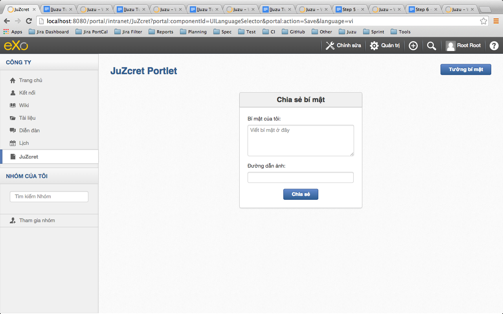
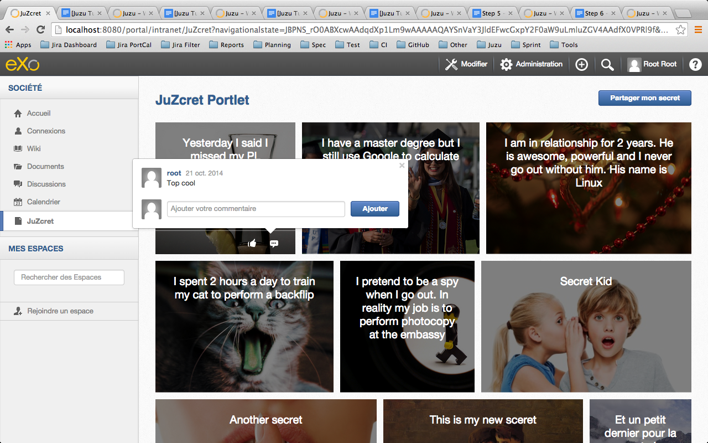

:docinfo1: docinfo1
:linkattrs:
:hardbreaks:

= Step 6 - Let's all the world create new secrets

We are close to end guys. In this step we will make our JuZcret portlet understandable for the *whole world !* Ok for this tutorial we will just manage *french and vietnamese language* but when you will understand the concept feel free to add all languages you want.

= Internalization and Localization

== Internalization

Internalization is the process of *developing software* whose core design does *not make assumptions based on a language*. It means that all messages and labels in the application can be *translated* to all *supported languages*.

NOTE: Juzu *support i18n natively* in the core. We just need to modify all the labels in all our templates. Next time, remember to do it as soon you start developing your template.

Update the +editMode.gtmpl+ template:

[source,html]
----
#{param name=enableComment/}

<form action="@{JuZcretApplication.enableComment()}" method="POST" role="form">
    <h5>&{label.configuration}</h5>
    <input type="checkbox" name="enableComment" <%=enableComment ? "checked" : "" %>/>&{label.enableComment}
    <button type="submit">&{label.save}</button>
</form>
----

The syntax of retrieving *i18nized message* is +&{label}+. For instance we've replaced +<h5>Configuration</h5>+ with +<h5>&{label.configuration}</h5>+

We need to do it for all the labels in all *JuZcret templates*:

+addsecret.gtmpl+:
[source,html]
----

    

        

            

                <h3 class="title">JuZcret Portlet</h3>
            

            

                <a class="btn btn-primary" href="@{JuZcretApplication.index()}" role="button">&{label.secretWall}</a>
            

        

    

    

        

            <h4 class="title">&{label.shareSecret}</h4>
            

                <form class="share-secret-form" action="@{JuZcretApplication.addSecret()}" method="POST" role="form">
                    

                        <label class="control-label" for="mySecret">&{label.mySecret}:</label>
                        

                            <textarea id="mySecret" rows="3" name="msg" placeholder="&{label.writeSecret}"></textarea>
                        

                    

                    

                        <label class="control-label" for="secrImgUrl">&{label.img}:</label>
                        

                            <input type="text" id="secrImgUrl" name="imgURL" placeholder="">
                        

                    

                    

                        

                            <button type="submit" class="btn btn-primary">&{label.share}</button>
                        

                    

                </form>
            

        

    

----

+secretWall.gtmpl+:
[source,html]
----
#{param name=secretsList/}
#{param name=enableComment/}

    

        

            

                <h3 class="title">JuZcret Portlet</h3>
            

            

                <a class="btn btn-primary" href="@{ JuZcretApplication.addSecretForm()}"
                   role="button">&{label.shareSecret}</a>
            

        

    

    <ul class="secret-wall-list clearfix">
        <% secretsList.each { secret -> %>
        <li class="secret" data-secretId="${secret.id}">
            

                
${secret.message}

                

                    <a class="btn-like secr-toggle-link toggle-like-comment" href="#"><i
                            class="uiIconThumbUp uiIconWhite"></i></a>
                    <a class="btn-popup-comment secr-toggle-link toggle-write-comment" href="#"><i
                            class="uiIconComment uiIconWhite"></i></a>
                

                

                    <button class="closePopover close" type="button">&times;</button>
                    

                    

                        

                            <ul class="secr-comments-list">
                                <% secret.getComments().each { comment -> %>
                                <li><!--Add class .open-popover to display popover -->
                                    

                                        <a class="pull-left" href="http://localhost:8080/portal/intranet/profile/${comment.userId}">
                                            
                                        </a>

                                        

                                            

                                                <a class="cm-user-name" href="http://localhost:8080/portal/intranet/profile/${comment.userId}">${comment.userId}</a> ${comment.createdDate}
                                            

                                            
${comment.content}

                                        

                                    

                                </li>
                                <% } %>
                            </ul>
                        

                        

                            <button class="btn-comment btn btn-primary pull-right">&{label.comment}</button>

                            

                                

                                    

                                        

                                        

                                            <textarea name="comment" class="secret-add-comment" placeholder="&{label.addComment}"></textarea>
                                        

                                    

                                

                            

                        

                    

                

            

        </li>
        <% } %>
    </ul>

----

That's it for internationalizing templates.

Now how can I manage the translation of +&{label.configuration}+ ?
It's very *simple and easy in Juzu*. You just need to configure the path of your bundle in the +portlet.xml+ and then create a java resource bundle file (*.properties or *.xml) per language.

So first update the +portlet.xml+ file in +src/main/webapp/WEB-INF+ folder:

[source,xml]
----
<portlet-app>
   <portlet>
     <portlet-name>JuzcretApplication</portlet-name>
     [...]
     </supports>
     <resource-bundle>locale.portlet.juzcret</resource-bundle>
     <portlet-info>
     [...]
   </portlet>
</portlet-app>
----

The *resource-bundle* tell portlet container to find the resource bundle files in +/locale/portlet/juzcret_*.properties+.

== Localization

Localization is the process of *customizing our app for a particular language*. That process includes the *translation* of labels and messages into a *native language*.
In this tutorial we will limit support to French and Vietnamese.

Add the resource bundle files to this path +/src/main/resources/locale/portlet/+ as we declared in +portlet.xml+:

+juzcret.properties+ for default language (English in eXo Platform)

[source,text]
----
label.addComment=Add your comment
label.shareSecret=Share my secret
label.configuration=Configuration
label.enableComment=Enable Comment
label.save=Save
label.mySecret=My secret
label.writeSecret=Write your secret here
label.img=Image URL
label.share=Share
label.comment=Comment
label.secretWall=Secret Wall
----

+juzcret_vi.properties+ for Vietnamese

[source,text]
----
label.shareSecret=Chia s\u1EBB b\u00ED m\u1EADt
label.configuration=C\u1EA5u h\u00ECnh
label.enableComment=Cho ph\u00E9p b\u00ECnh lu\u1EADn
label.save=L\u01B0u
label.mySecret=B\u00ED m\u1EADt c\u1EE7a t\u00F4i
label.writeSecret=Vi\u1EBFt b\u00ED m\u1EADt \u1EDF \u0111\u00E2y
label.img=\u0110\u01B0\u1EDDng d\u1EABn \u1EA3nh
label.share=Chia s\u1EBB
label.secretWall=T\u01B0\u1EDDng b\u00ED m\u1EADt
label.addComment=Th\u00EAm b\u00ECnh lu\u1EADn
label.comment=B\u00ECnh lu\u1EADn
----

+juzcret_fr.properties+ for French

[source,text]
----
label.shareSecret=Partager mon secret
label.configuration=Configuration
label.enableComment=Activer les commentaires
label.save=Sauvegarder
label.mySecret=Mon secret
label.writeSecret=Ecrit ton secret ici
label.img=URL de l'image
label.share=Partager
label.secretWall=Mur des secrets
label.addComment=Ajouter votre commentaire
label.comment=Ajouter
----

That's all.
Re-compile and deploy JuZcret eXo Platform as explain in previous step of this tutorial:
[source,text]
----
$ mvn clean install
----
Copy/Paste the war _(replace the old one)_ in the webapp folder of eXo Platform, start the server and open link:http://localhost:8080/portal/intranet/JuZcret[JuZcret page created in step 1, window="_blank"].

Now you can share secret in Vietnamese:

or look at the Secret Wall and add comments in French:

Here we are. An *international JuZcret application* ready for sharing secrets of the people of the world.

Hum do you not think that we forgot some important things during all this steps...? Let's fix it in link:./step7.html[the last step]

_The final source of step 6 is available for link:https://github.com/juzu/portlet-tutorial/tree/step-6[downloading on Github, window="_blank"]_

++++

++++
